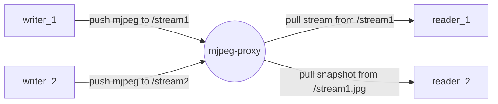
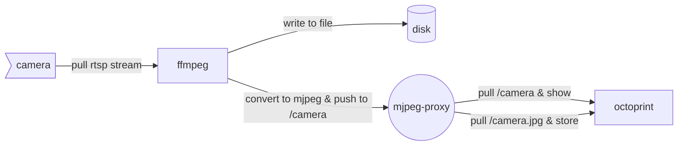

# mjpeg-proxy

- receive one or many mjpeg streaming
- send mjpeg streaming or snapshot

## usage

```shell
go install github.com/wolf-joe/mjpeg-proxy@latest
# set host & port, then run
HOST_PORT=":8091" $GOBIN/mjpeg-proxy
```

## arch



## usecase

